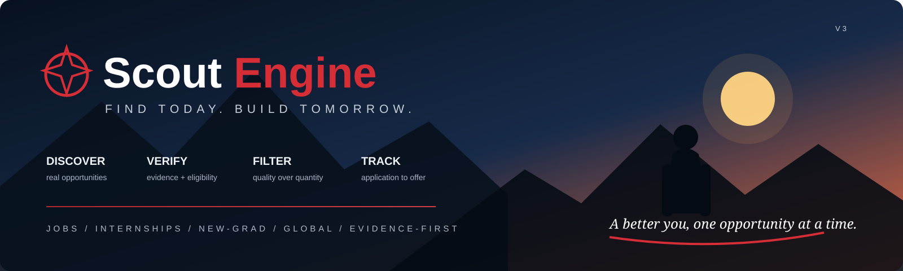

<p align="center">
  
</p>

# Scout Engine 🛰️

**An autonomous, evidence-first career opportunity radar.**

Scout Engine continuously discovers, verifies, filters and tracks high-signal **new-grad roles** and **final-year internships** from public company career sources. It is deliberately quality-first: an empty slot is better than a fabricated salary, guessed eligibility condition, or weak opportunity.


> **Find today. Build tomorrow.** One verified opportunity at a time.

---

## What it does

Scout turns a messy universe of career pages into an auditable pipeline:

```text
Discover → Normalize → Enrich → Verify → Gate → Dedupe → Prioritize → Track → Learn
```

It prefers structured sources first, promotes detected ATS fingerprints into native adapters, falls back to standards-aware career-page crawling when necessary, and uses browser rendering only as the final public-web fallback.

### The target

The production goal is **up to 10 NEW qualified career opportunities per daily run**, without lowering quality gates to fill a quota.

- New-grad / entry-level full-time roles with verified minimum base compensation **> ₹10 LPA**
- Final-year internships, with explicit PPO / return-offer / full-time-conversion evidence receiving special priority
- Competitions and hackathons excluded from the production career lane
- Research-heavy roles requiring formal publication evidence blocked when the candidate profile does not satisfy it

---

## Source intelligence

Scout chooses the strongest public evidence path available:

1. **Official ATS / structured API**: Greenhouse, Lever, Ashby, Workable, SmartRecruiters
2. **JobPosting JSON-LD**
3. **robots.txt + sitemap-assisted discovery**
4. **Static job-detail HTML**
5. **Playwright browser fallback**

The crawler never logs in, bypasses CAPTCHAs, rotates proxies, or defeats access controls. A blocked or failed source is recorded as a failed scan, **never as evidence that a job disappeared**.

---

## Evidence-first data model

`data/opportunities.json` is the canonical ledger. GitHub Issues are the human-facing cockpit, not the database.

Each opportunity can retain source status, extraction method, application URL, source confidence, field-level provenance, compensation evidence, dated FX conversion, PPO/conversion evidence, first/last-seen timestamps, lifecycle state, and successful-miss counters.

### Closure safety

A posting is not inferred closed because one crawler had a bad morning.

```text
source failure        → no closure evidence
successful scan + hit → missing counter = 0
successful scan + miss
                     → missing counter += 1
2 successful misses  → eligible for inferred expiry
```

Applied / OA / interview history is preserved even when the public posting later disappears.

---

## Architecture

```text
src/scout_engine/
├── crawl/          HTTP, robots, sitemap, HTML, JSON-LD, browser fallback
├── discovery/      employer registry and ATS fingerprinting
├── enrich/         eligibility, conversion evidence, research and FX
├── sources/        structured ATS and career-page adapters
├── engine.py       hard gates + scoring decision path
├── runner.py       production orchestration and stale reconciliation
├── github_sync.py  issue/lifecycle synchronization
└── models.py       canonical contracts and compatibility boundary

config/
├── profile.yaml    candidate facts and hard constraints
├── companies.yaml  employer-owned career registry
├── boards.yaml     verified ATS identifiers
└── sources.yaml    crawler/source policy

data/
├── opportunities.json
├── crawl-cache.json
├── fx-rates.json
├── scan-stats.json
└── source-stats.json
```

For the deeper internals, see [Architecture](docs/ARCHITECTURE.md), [Source Intelligence](docs/SOURCE_INTELLIGENCE.md), and [Scoring](SCORING.md).

---

## Lifecycle

```text
discovered → qualified → reviewing → applied → OA → interview → offer → offer_accepted
                    ↘ not_pursuing
                              ↘ rejected / withdrawn / expired / closed
```

Application state is explicit. Applying does not automatically close the GitHub issue.

---

## Run it

```bash
python -m pip install -e ".[dev,browser]"
python -m playwright install chromium

pytest
scout-engine validate
scout-engine scan
scout-engine stats
scout-engine weekly
scout-engine daily
```

The CI pipeline also exercises the stateful daily path so persisted-schema or crawler integration regressions are caught before the scheduled production run.

---

## Automation

| Workflow | Purpose |
| --- | --- |
| `tests.yml` | Unit/regression tests, canonical validation and daily-pipeline smoke test |
| `scout-daily.yml` | Daily discovery, reconciliation, analytics and state persistence |
| `scout-weekly.yml` | Weekly funnel report |
| `sync-labels.yml` | GitHub issue taxonomy synchronization |

The daily workflow is intentionally shifted away from GitHub's top-of-hour congestion window.

---

## Non-negotiable rails

Scout will not auto-apply, auto-send outreach, guess salary/PPO/deadlines/eligibility, crawl authenticated/private systems, bypass robots/access controls, use source failures as closure evidence, or let learned preferences override hard gates.

**Quality over quota. Evidence over inference. State over vibes.** 🔭

---

## Author

**Rahul Sharma**  
B.Tech CSE (AI & Data Science), IIIT Manipur

Built as personal career infrastructure: less tab-hoarding, more verified signal.
